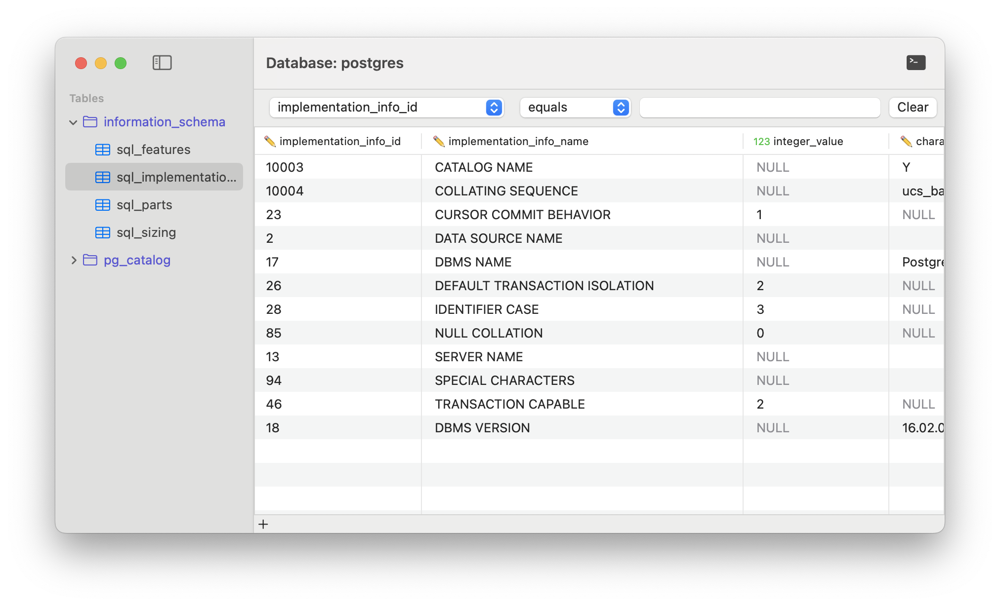

# Searchlight - Postgres MacOS Client

## Installation
Only installation method (other than building from source) at this moment is to download from the [Releases Page](https://github.com/ravelantunes/Searchlight/releases).
> I’m using my personal Apple developer account so I can’t notarize the app with Apple. If you try to install from the GitHub releases page MacOS will warn that it can’t verify the developer identity, so you will need to approve the install on Settings > Privacy, or build from source.

## Goal
Searchlight is a native macOS, open-source PostgreSQL client designed to be simple, lightweight, and developer-friendly. It offers a clean and intuitive interface for managing databases and running queries without the complexity of full-scale database management tools. Searchlight focuses on delivering a smooth and efficient experience for developers who need quick and easy access to their PostgreSQL databases.

## Features

- Connection Management
    - [x] Save favorite connections
        - [ ] Colors
    - [ ] SSH tunneling
    
- Database Browser
    - [x] Quick search and filter
    - [ ] Pagination
    - [x] Relationship linking on data view
    - [ ] Copy row as JSON, CSV, SQL, etc
    - [ ] Connect in read-only mode
    - [ ] Browse databases
    - [x] Browse tables
    - [ ] Browse indexes
    - [ ] Browse triggers
    - [ ] Browse views
    - [ ] Browse functions
    - [ ] Browse extensions
    - [ ] Browse roles
    - [x] Browse schemas
    - [ ] Browse sequences
    - [ ] Support range types
    
- Data Manipulation
    - [x] Sort Rows
    - [x] Edit Row
    - [x] Insert Row
    - [ ] Multi-row manipulation
    
- Database Management
    - [ ] Create/Delete databases
    - [ ] Switch databases
    - [ ] Create/Delete/Modify tables
    - [ ] Create/Delete/Modify indexes
    - [ ] Create/Delete/Modify triggers    
    - [ ] Manage users and roles
    - [ ] View console/logs/monitoring

- Query Editor
    - [x] Query editor
    - [x] Syntax highlighting    
    - [ ] schema-aware SQL autocomplete
        - [ ] AI autocomplete
    - [ ] Query history and favorites
    
- Import/Export
    - [ ] Import/Export CSV
    - [ ] Import/Export SQL
    - [ ] Import/Export JSON
    
- Postgres Extensions
    - [ ] Support for Postgres extensions
    
- Misc    
    - [ ] Github action builds
